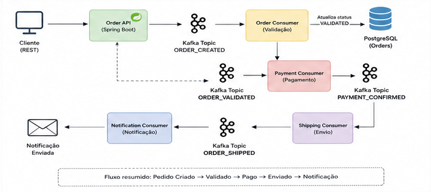

# 📦 Order Processing System

Sistema de processamento de pedidos baseado em **arquitetura orientada a eventos (Event-Driven)** utilizando **Java 21**, **Spring Boot** e **Apache Kafka**.

-

## 📊 Diagrama de fluxo

---

## 🚀 Sobre o Projeto

Este projeto simula o fluxo completo de um pedido dentro de um sistema distribuído:

1. Um pedido é criado via API REST
2. Um evento é publicado no Kafka
3. Múltiplos consumidores processam o pedido em etapas:
   - Validação
   - Pagamento
   - Envio
   - Notificação

---

## 🧠 Arquitetura

Inspirado em **Clean Architecture + Event-Driven Architecture**

- interfaces → Controllers
- application → Services (use cases)
- domain → Regras de negócio
- infrastructure → Kafka, DB, configs

---

## 🔄 Fluxo

Cliente → API → Kafka (ORDER_CREATED)
→ Validação → Pagamento → Envio → Notificação

---

## 🧰 Tecnologias

- Java 21
- Spring Boot 3.x
- Spring Web
- Spring Data JPA
- Spring Kafka
- PostgreSQL
- Docker
- JUnit 5 + Mockito
- Testcontainers

---

## 🧩 Design Patterns

- Strategy → métodos de pagamento
- Factory → criação das estratégias
- Builder → criação de eventos
- Repository → acesso a dados
- Observer → Kafka (pub/sub)

---

## ⚙️ Setup

### Pré-requisitos

- Java 21
- Docker
- Maven

### Subir infra

docker-compose up -d

---

## ▶️ Rodar

mvn spring-boot:run

---

## 🧪 Testes

mvn test

mvn verify

---

## 📡 Endpoint

POST /orders

{
  "product": "Notebook",
  "amount": 5000,
  "paymentType": "PIX"
}

---

## ✅ Checklist

- [x] Projeto base
- [x] Kafka
- [x] Producer
- [x] Consumers
- [x] Persistência
- [x] Testes unitários
- [ ] Testes integração
- [ ] Retry/DLQ

---

## ⚠️ Problemas

- Sem retry
- Sem DLQ
- Sem idempotência
- Testes integração instáveis

---

## 🚀 Evolução

- Retry + backoff
- DLQ
- Observabilidade
- Tracing
- Microservices
- Segurança (JWT)

---

## 💡 Objetivo

Projeto para portfólio demonstrando arquitetura moderna e boas práticas.
